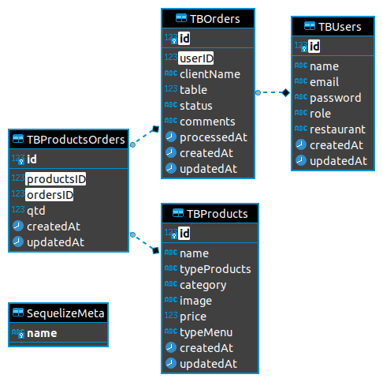
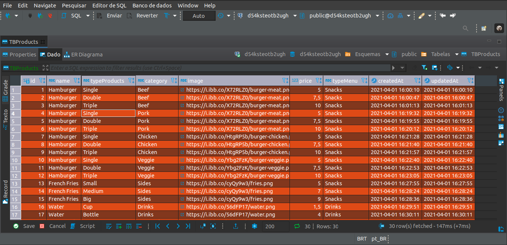

# Burger Queen API  - Back-end

🌟 Uma _API rest_ para pedidos em um restaurante 🍔. Link para consumo da API [clique aqui!](https://cbmo-burger-queen-api.herokuapp.com) 🌟 

## Índice

 <a href="#-desafio">Desafio</a> •
 <a href="#-introdução">Introdução</a> •
 <a href="#-processo-de-criação">Processo de criação</a> • 
 <a href="#-tecnologias">Tecnologias</a> • 
 <a href="#-desenvolvedora">Desenvolvedora</a> • 

---

## Desafio 💪

Esse projeto foi desenvolvido individualmente durante o bootcamp da Laboratoria. A [proposta]((https://github.com/Laboratoria/SAP005-burger-queen-api)) foi desenvolver um _servidor web_ , ou seja , um Back-End para manejar os dados. Neste caso, isso foi feito através
de uma _API rest_ que será compatível com as requisições vindas do front.

 

## Introdução

Um pequeno restaurante de hamburgueres, que está crescendo, necessita de um
sistema para realizar pedidos usando um _tablet_, e que os enviem à
cozinha para que sejam preparados de forma ordenada e eficiente.

A interface front-end da aplicação Burger Queen já foi criado. Para acessar [clique aqui!](https://burgerlicious-git-main-cbalieiro.vercel.app/)

 

## Processo de criação

📆 **Organização e planejamento**

Esse trabalho foi desenvolvido sob demanda e já recebemos as definições prontas, a partir disso o planejamento foi dividindo por três sprint de 7 dias cada. 📋

##
 

⚙️ **Requisitos para Entrega**

O código do projeto deveria estar em um repositório no GitHub.
O _deploy_ para produção deveria ser feito utilizando um serviço de hospedagem como
o [Heroku](https://www.heroku.com/home), que tem integração com o
[PostgreSQL](https://www.heroku.com/postgres).

 

⚙️ **Funcionalidades**

A API possui os seguintes endpoints:

### `/users`

* [x] `GET /users`
* [x] `GET /users/:uid`
* [x] `POST /users`
* [x] `PUT /users/:uid`
* [x] `DELETE /users/:uid`

### `/products`

* [x] `GET /products`
* [x] `GET /products/:productid`
* [x] `POST /products`
* [x] `PUT /products/:productid`
* [x] `DELETE /products/:productid`

### `/orders`

* [x] `GET /orders`
* [x] `GET /orders/:orderid`
* [x] `POST /orders`
* [x] `PUT /orders/:orderid`
* [x] `DELETE /orders/:orderid`

 

**Detalhes sobre a Configuração**

 

Relacionamento de Tabelas:

 

  </img>

 

Tabelas de Produtos:

 

  </img>

 

🔎 **Testes**

Para testes com a API. Segue Modelos:

Users:

{
    // {id} Auto Increment by API
    "id": INTEGER,
    
     // Required fields:
    "name": "STRING",
    "email": "STRING",
    "role": "STRING",
    "restaurant": "burgerlicious",
    
    // { createdAt,updatedAt } Auto Increment by API
    "createdAt": "2021-03-31T11:48:13.536Z",
    "updatedAt": "2021-03-31T12:01:44.347Z"
  }
  
Products

{
    // {id} Auto Increment by API
    "id":  INTEGER,
    
    // Required fields:
    "name": "STRING",
    "typeProducts": "STRING",
    "category": "STRING",
    "image": "STRING",
    "price": NUMERIC,
    "typeMenu": "STRING",
    
    // { createdAt,updatedAt } Auto Increment by API
    "createdAt": "2021-04-01T19:55:44.812Z",
    "updatedAt": "2021-04-01T19:55:44.812Z"
}

{   // {id} Auto Increment by API
    "id":  INTEGER,
    
    "userID":  INTEGER,
    "clientName": "STRING",
    "table":  INTEGER,
    "comments": "STRING",
    "products": [
    {
      "id":  INTEGER,
      "qtd":  INTEGER,
    }]

}

 

🚧 **Futuras implementações:**

&nbsp;
📌 Com a experiência do Projeto anterior, a ideia é implmentar um Campo para Complementos vinculando ao Produto e ao Pedido. Afim de contabilizar valores e quantidades. Para isso, terei que criar a modelagem e o relacionamento da Tabela "TBComplements".
  

---

## Tecnologias

&nbsp;
🛠 [Node.js](https://nodejs.org/en/)

&nbsp;
🛠 [Express](https://expressjs.com/pt-br/)

&nbsp;
🛠 [Sequelize](https://sequelize.org/)

&nbsp;
🛠 [PostgreSQL](https://www.postgresql.org/)

&nbsp;
🛠 JavaScrip (ES6)

---

## Créditos

&nbsp;
[Laboratoria](https://www.laboratoria.la/) 💛

&nbsp;
[Heroku](https://www.heroku.com) 🛠

&nbsp;
[Insomnia](https://insomnia.rest/) 🛠

---

## Desenvolvedora

Projeto desenvolvido com entusiasmo por:

&nbsp;
🦸 [Camila Oliveira](https://github.com/cbalieiro)
